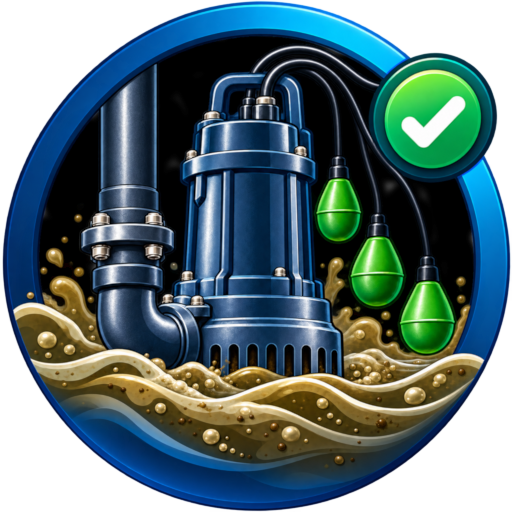

<h1 align="center">Mantenimiento preventivo · Bomba de aguas fecales</h1>

Guía didáctica, simulación, registro de pruebas reales e histórico para mantenimiento preventivo de una bomba de aguas fecales.

## Registro de pruebas

El formulario genera un JSON con fecha, hora en formato 24 h, responsable, comprobaciones, tiempo, intensidad, resultado global y observaciones. La fecha y la hora de la prueba se introducen manualmente.

El resultado global se calcula automáticamente: solo es `OK` si todas las comprobaciones están en `OK` y tiempo e intensidad están dentro de los límites definidos en `config.json`; en cualquier otro caso es `Revisar`.

Los campos de tiempo e intensidad se muestran en verde cuando están dentro de rango y en rojo cuando están fuera.

## Histórico

Los JSON oficiales se suben a `data/pruebas/`. El workflow `Actualizar índice de pruebas` valida los archivos y regenera `data/index.json`.

El histórico admite varias pruebas en un mismo día, las ordena por fecha y hora y permite abrir el detalle completo desde las gráficas. Los registros antiguos sin `hora` siguen siendo compatibles.

## Configuración

Las referencias, tolerancias y parámetros de simulación se modifican únicamente en `config.json`.

## Simulación

La simulación libre es didáctica e independiente del registro real. Incluye nivel de agua, boyas, funcionamiento AUTO/MANUAL y cronómetro de bombeo.

## Publicación

GitHub Pages debe publicar la rama `main` desde `/ (root)`.
